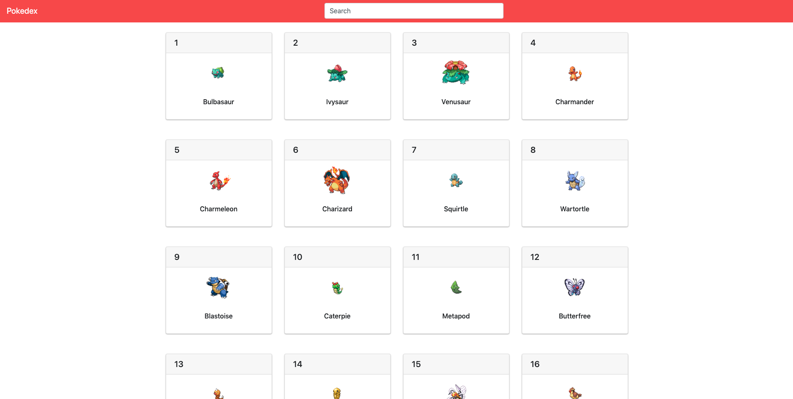

# Pokedex



---

### Table of Contents

- [Description](#description)
- [How To Use](#how-to-use)
- [References](#references)

---

## Description

Pokedex is a lighthearted web application built using Vue.js and utilises the [Poke API](https://pokeapi.co/) database. The app allows a user to search for various information about Pokemon, locations and moves. 

I experimented with Bootstrap after some research on front end JavaScript frameworks and really enjoyed working with it. 

I added a search bar to this project last minute and I am glad I did, I gained a deeper understand of how props are handled in Vue while I struggled trying to implement it, it was worth it!

#### Technologies

- Vue.js
- Node
- Bootstrap

[Back To The Top](#pokedex)

---

## How To Use

#### Installation

```
npm i
```
```
npm run serve
```
  


#### API Reference

```javascript
 fetch("https://pokeapi.co/api/v2/pokemon?limit=100&offset=0")
            .then(res => res.json())
            .then(pokemons => this.pokemons = pokemons.results)
```
[Back To The Top](#pokedex)

---

## References

- [Vue Docs](https://vuejs.org/v2/guide/)
- [Bootstrap Docs](https://bootstrap-vue.org/) 


[Back To The Top](#pokedex)